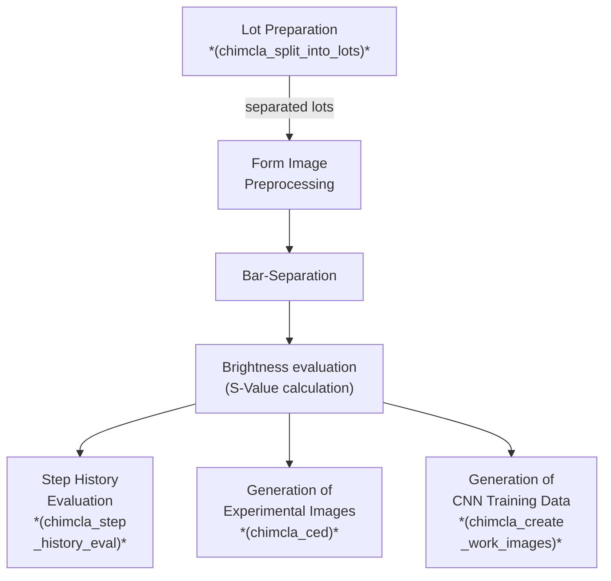

# `chimcla` Chocolate Image Classification


## Installation


### Preparation

- `pip install --upgrade pip setuptools wheel`
- `pip install -r requirements.txt`

### Installation in Development Mode

- `pip install -e .`


### General Remark on Installing Python Packages

As of June 2025 it is recommended to use `uv pip ...` instead of just `pip ...` for the above commands. The third-party tool `uv` (see <https://docs.astral.sh/uv/>) handles installations and upgrade much faster than the original tool `pip` (which is, however, the recommended fallback in case of problems).


## (Preliminary) Pipeline Description

<!-- The following is a "mermaid chart". It is automatically rendered by gitlab and github. Locally it can be previewed e.g. in vs code by this plugin: https://docs.mermaidchart.com/plugins/visual-studio-code.  -->



### Preprocessing

#### `stage_0f_resize_and_jpg.py` → probably obsolete

- Convert images to jpg (originally we used .png) and resize width to 1000px.
- uses `asyncio` to allow for parallel processing → speedup
- not yet included in the chimcla command line interface (see `cli.py`)
- "0f" comes from some internal versioning which enumerated the necessary processing steps

#### `stage_1a_preprocessing.py` → important

Contains class `Stage1Preprocessor` with:
```python
    def pipeline(self, fpath):
        # ...
        iic = self.iic_map[fpath] = ImageInfoContainer(fpath, data_base_dir=self.data_base_dir)
        self.step01_mogrify_1000jpg(iic)
        self.step02_empty_slot_detection(iic)
        self.step03_cropping(iic)
        self.step04_shading_correction(iic)
```

> **TODO:** not yet included in the chimcla command line interface (see `cli.py`)


#### `stage_2a_bar_selection.py` → important

- There is an (incomplete) newer version of this module: `stage_2a1_bar_selection_new.py`

- contains:
    - class `CavityCarrierImageAnalyzer` ("FormenTrägerBildAnalyzer")
    - class `ExtendedSqliteDict`


---

---

## Important `chimcla` Commands

**Note:** Only parts of the chimcla functionality have been ported to the "professional" command line interface (see section `[project.scripts]` in `pyproject.toml`). Other parts are only available as ordinary python scripts. See also `docs/README_old.md`.


### Split into Lots

#### Background

There are many (\>\>100K) raw images. To simplify their handling they are split into "lots". Each lot corresponds to one cycle of production (e.g. 7 days).
Each lot is subdivided into chunks of (ca.) 1000 raw images.


#### Directory Structure

```
data_images
├── __chimcla_data__.txt    → the presence of this file indicates that its parent directory
│                             is the root of all relevant chimcla-data
├── jpg1000                 → rescaled work images (jpg), result of manual preprocessing
├── raw                     → original images in png format (before saving every image)
├── raw_jpg                 → original images in jpg format (necessary to reduce transfer load)
│   ├──
│   └──
│
├── pp_result               → host to the output dirs of automated preprocessing
│   ├── ...
│   └── <lotdir>
│       ├── part000
│       │   └── shading_corrected
│       │                   ↳ main output of preprocessing
│       └── ...
│
└── png_paths.txt           → file created by preparation command
```


#### Usage

- preparation: create a list of paths:
    - manually move all images from `$HOME/mnt/XAI-DIA-gl/Sascha/Images_from_Peine` to `$HOME/mnt/XAI-DIA-gl/Carsten/data_images/raw_jpg` (speed: 10K/min)
    - workdir: `$HOME/mnt/XAI-DIA-gl/Carsten/data_images/raw_jpg`
    - command: `find . -type f -name '*.jpg' > jpg_paths.txt` (takes approx. 40s for 200K image)
- usage: `chimcla_split_into_lots ~/mnt/XAI-DIA-gl/Carsten/data_images/raw_jpg/jpg_paths.txt` (takes 20m for 200K images)
- manual post processing
    - move subdirectories of `data_images/raw_jpg/lots/` into `data_images/lots` (make sure that nothing is overwritten)

#### Find images within lot dirs

- go to the lot-dir which is the youngest before your date
- Example: `find . -iname "*2023-06-27_09-10*"`


### Create Work Images

- Example call: `chimcla_create_work_images ~/mnt/XAI-DIA-gl/Carsten/data_images/lots/2024-07-08_06-03-45__2d__56.7k/part000`
    - Results: within `~/mnt/XAI-DIA-gl/Carsten/data_images/pp_result/2024-07-08_06-03-45__2d__56.7k/part000` the following subdirectories are created:
    - `jpg0` → intermediate results (can be deleted)
    - `cropped` → intermediate results (can be deleted)
    - `shading_corrected` → starting point for cell based evaluation


### Step History Evaluation

- overview:
    - `chimcla_step_history_eval --help`
- usage example
    - `chimcla_step_history_eval -l ~/mnt/XAI-DIA-gl/Carsten/logs/classifier-2023-07-10_since_2023-06-26.log --csv-mode stage3_results__history_test_y\* 300`
    - explanation:
        - `-l <path_to_log_file>`
        - `--csv-mode <pattern> <critical-score-limit>`
        - `<pattern>`: A pattern for preprocessed image files like `directory/*.jpg`
        - Note that in order to pass an asterisk character (`*`) as part of an argument to the python script it has to be escaped (prepended by a backslash). Otherwise the shell (e.g. bash) tries to expand it before passing the arguments to the script.
        - `<critical-score-limit>`: Lower limit for "cumulated criticality score" for images which should be considered in the step history creation.
        The criticality score specifies how much a cell image deviates from the expectation (e.g. homogenous brown). Values below 20 are considered unproblematic, values above 100 typically show bright regions or other obvious problems. "Cumulated" means that the criticality scores of all 81 cells of the image are added.


### Creation of Experimental Data ("ced")

This tool suite deals with the creation of images aimed for a particular user study carried out in early 2024.

- overview:
    - `chimcla_ced --help`
- usage example:
    - `chimcla_ced --img_dir /home/ck/mnt/XAI-DIA-gl/Carsten/bilder_jpg2a/cropped/chunk001_shading_corrected/ --suffix _history_test_y -H`
    - explanation:
        - `--img_dir <path>`: specify source directory
        - `--suffix <path>`: specify target directory
        - `-H`: activate history-evaluation mode
    - further options:
        - `--help`: print help (see all options)
        - `--limit LIMIT`: limit the number of processed files
        - `--no-parallel`: sequential mode (no parallelization) → better for debugging
- another example:
    - store the long path in an environment variable to make the actual command easier understandable
    - `export IMG_DIR="$HOME/mnt/XAI-DIA-gl/Carsten/data_images/pp_result/2024-07-08_06-03-45__2d__56.7k/part000/shading_corrected"`
    - `chimcla_ced --img_dir $IMG_DIR --suffix _history_eval -H --limit 10 --no-parallel`


## Background information

### Exposure Time:

During production lot `2024-06-18_12-15-58__1d__14.0k` we fixed a problem with the exposure time.

- Last old image: `part002/2024-06-18_17-47-20_C0.png` (usually these images ended on `_C50` for "pause mode")
- First new image: `part002/2024-06-18_18-21-01_C51.png`
- See also: `git blame` in the xaidia-server repo.


### Image saving frequency (PNG → JPG):

During production lot `2024-06-18_12-15-58__1d__14.0k` we fixed the problem that not every image was saved.

- Last old image: `part013/2024-06-19_16-30-38_C51.png`
- First new image: `part013/2024-06-20_10-58-57_C51.png `

This caused problems with the image transfer (too much data per time). Thus we changed the saving format from png to jpg. Theses changes took action beginning from the first image of `2024-06-20_11-10-00__1d__24.5k/part000`.

### Problems with the lamp (or camera)

In August there have been problems with too dark images. We changed the exposure time (and restarted everything)- Problems seemed to be solved but overall lightness of the images might have changed. Images now get `_C54` in pause mode.

Later we discovered that images got gradually darker again over some hours.
