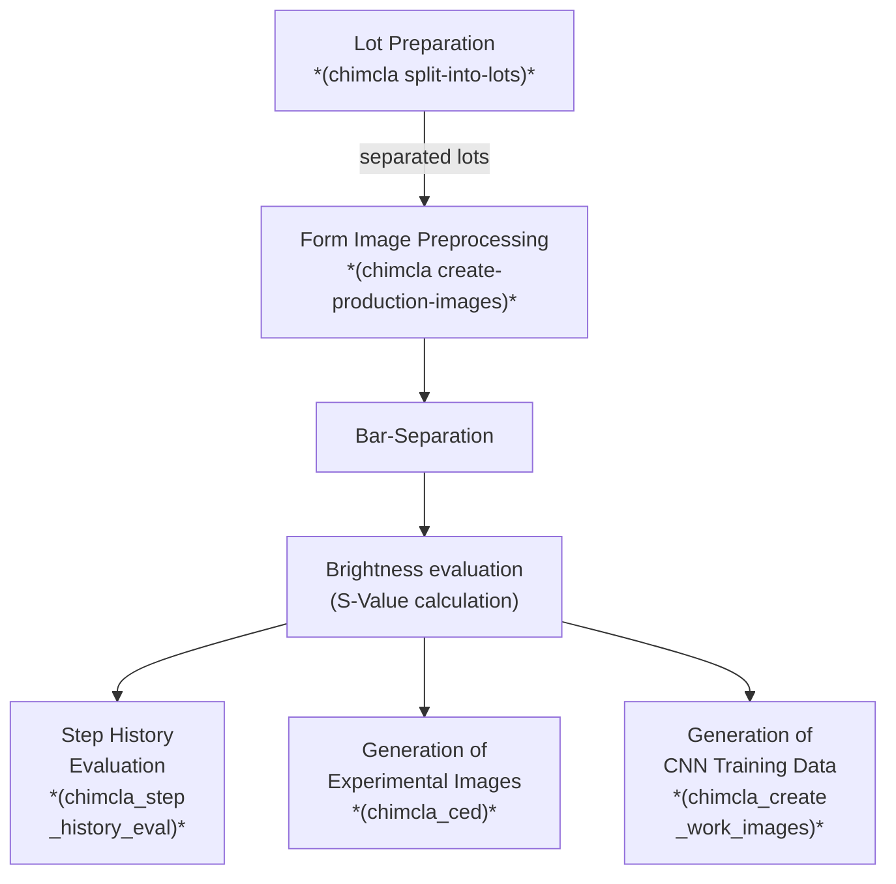

# Pipeline Description


<!-- The following is a "mermaid chart". It is automatically rendered by gitlab and github. Locally it can be previewed e.g. in vs code by this plugin: https://docs.mermaidchart.com/plugins/visual-studio-code.  -->

## Visual Overview



## Expected Directory Structure

```
data_images
├── __chimcla_data__.txt    → the presence of this file indicates that its parent directory
│                             is the root of all relevant chimcla-data
├── jpg1000                 → rescaled work images (jpg), result of manual preprocessing
├── raw                     → original images in png format (before saving every image)
├── raw_jpg                 → original images in jpg format (necessary to reduce transfer load)
│   ├──
│   └──
│
├── pp_result               → host to the output dirs of automated      preprocessing
│   ├── ...
│   └── <lotdir>
│       ├── part000
│       │   └── shading_corrected
│       │                   ↳ main output of preprocessing
│       └── ...
│
└── png_paths.txt           → file created by preparation command
```


```{eval-rst}
.. _step-0:
```

## Step 0: Lot Preparation

### Motivation and Background

There are many (\>\>100K) raw images. If they are located in a single directory typical file browsers
are very slow or even crash.
To simplify their handling they are split into "lots".
Each lot corresponds to one cycle of production without longer interruption (e.g. 3 days).
Each lot is subdivided into parts of (ca.) 1000 raw images.


### How To Do It

- preparation: create a list of paths:
    - manually move all images from `$HOME/mnt/XAI-DIA-gl/Sascha/Images_from_Peine` to `$HOME/mnt/XAI-DIA-gl/Carsten/data_images/raw_jpg` (speed: 10K/min)
    - workdir: `$HOME/mnt/XAI-DIA-gl/Carsten/data_images/raw_jpg`
    - command: `find . -type f -name '*.jpg' > jpg_paths.txt` (takes approx. 40s for 200K image)
- usage: `chimcla split-into-lots ~/mnt/XAI-DIA-gl/Carsten/data_images/raw_jpg/jpg_paths.txt` (takes 20m for 200K images)
- manual post processing
    - move subdirectories of `data_images/raw_jpg/lots/` into `data_images/lots` (make sure that nothing is overwritten)


```{eval-rst}
.. _step-1:
```
## Step 1: Form Image Preprocessing {#step-1}


```{eval-rst}
.. _step-2:
```
## Step2: Bar-Separation {#step-2}