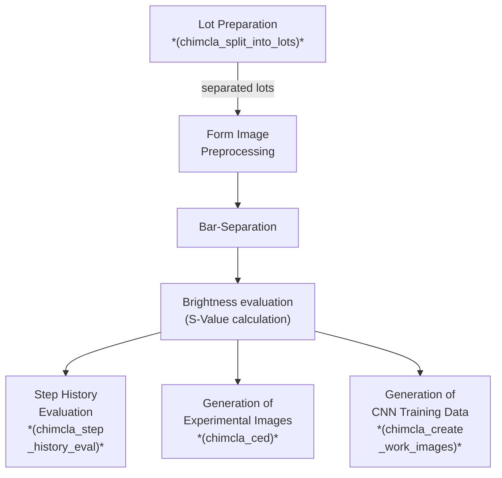

# Module Documentation

This documentation covers the chimcla package, which provides tools for image analysis and classification of cavity carrier images.


```{toctree}
:maxdepth: 1
:hidden:

api_links
apidocs/index
```

## Main Package

See [commented module documentation](api_links.md)

## Pipeline Description


<!-- The following is a "mermaid chart". It is automatically rendered by gitlab and github. Locally it can be previewed e.g. in vs code by this plugin: https://docs.mermaidchart.com/plugins/visual-studio-code.  -->

