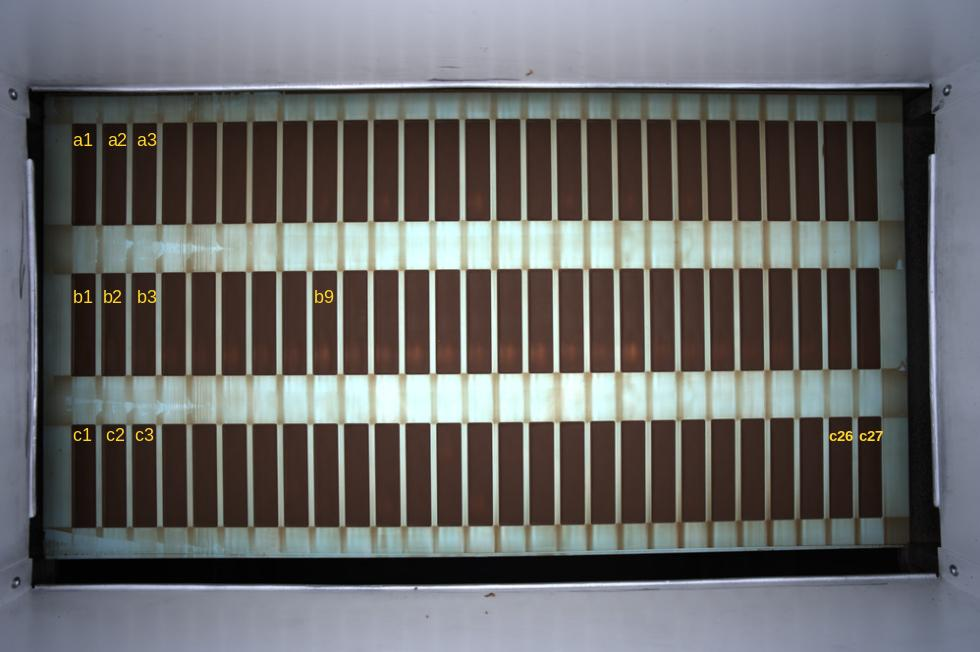

# Module Documentation

This documentation covers the `chimcla` (**ch**ocolate **im**age **cla**ssification) package, which provides tools for image analysis and classification of cavity carrier images (German: "Formenträgerbilder").


```{toctree}
:maxdepth: 1
:hidden:

background.md
cli_doc.md
api_links
apidocs/index
```

<!-- add image -->




## Overview

This documentation consist of the following parts:

- [Background](background.md)
- [Commented module documentation](api_links.md)
- [Command line interface documentation ](cli_doc.md)
